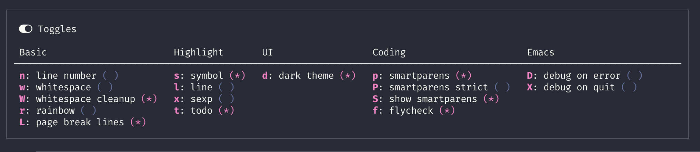

# Major Mode Hydra and Pretty Hydra

- [`pretty-hydra`](#pretty-hydra) makes it easy to create hydras with a pretty table
  layout with some other bells and whistles
- Based on `pretty-hydra`, [`major-mode-hydra`](#major-mode-hydra)
  allows you to create pretty hydras with a similar API and summon
  them with the same key across different major modes.

## Major Mode Hydra

[](https://melpa.org/#/major-mode-hydra)
[](https://stable.melpa.org/#/major-mode-hydra)

Inspired by [Spacemacs major mode leader
key](http://spacemacs.org/doc/DOCUMENTATION.html#major-mode-leader-key)
and based on the awesome [hydra](https://github.com/abo-abo/hydra),
this package offers an alternative way to manage your major mode
specific key bindings.

## Install

### package.el

This package is available on [MELPA](https://melpa.org).

<kbd>M-x</kbd> `package-install` <kbd>[RET]</kbd> `major-mode-hydra` <kbd>[RET]</kbd>

### Manual

This package depends on [hydra](https://github.com/abo-abo/hydra),
[dash](https://github.com/magnars/dash.el) and
[s.el](https://github.com/magnars/s.el). Make sure they are installed
first.

Download the source code and put it wherever you like and add the
directory to the load path:

```elisp
(add-to-list 'load-path "/place/where/you/put/it/")
```

## Get Started

`require` the package and bind the `major-mode-hydra` command to a key:

```elisp
(require 'major-mode-hydra)
(global-set-key (kbd "M-SPC") #'major-mode-hydra)
```

or if you prefer `use-package`:

```elisp
(use-package major-mode-hydra
  :ensure t
  :bind
  ("M-SPC" . major-mode-hydra))
```

Then define a hydra for a major mode like this:

``` elisp
(major-mode-hydra-define emacs-lisp-mode nil
  ("Eval"
   (("b" eval-buffer "buffer")
    ("e" eval-defun "defun")
    ("r" eval-region "region"))
   "REPL"
   (("I" ielm "ielm"))
   "Test"
   (("t" ert "prompt")
    ("T" (ert t) "all")
    ("F" (ert :failed) "failed"))
   "Doc"
   (("d" describe-foo-at-point "thing-at-pt")
    ("f" describe-function "function")
    ("v" describe-variable "variable")
    ("i" info-lookup-symbol "info lookup"))))
```

Now when your are in a elisp buffer, press `M-SPC` will bring up this
(pretty) hydra (I use
[hydra-posframe](https://github.com/Ladicle/hydra-posframe)):


### `major-mode-hydra-define`

`major-mode-hydra-define` takes 3 arguments, the `mode`, the `body`
and the `heads-plist`.

#### `mode`

`mode` is the name of the major mode, e.g. `emacs-lisp-mode`. It can
also be a list of modes. This is useful in cases where multiple major
mode share a lot of commands, e.g. `clojure-mode`,
`clojurescript-mode` and `clojurec-mode`.

#### `body`

`body` is the hydra body plist as defined by `defhydra`. Apart from
what `defhydra`'s options, `major-mode-hydra-define` has a few
additional options. See the [Pretty Hydra](#pretty-hydra) section
below for details.

Some hydra body options have configurable default values if they are
not specified:

- The `:color` is set to `teal` which means by default it quits the
  hydra after a command is executed. For major mode commands, this is
  probably what you want. You can override it for each head using head
  options:

  ```elisp
  (major-mode-hydra-define clojure-mode nil
    ("Load"
     (("k" cider-load-buffer "buffer" :exit nil)
      ("l" cider-load-file "file" :color red))))
  ```

- The `:separator` is set to `major-mode-hydra-separator`
- The `:quit-key` is set to `major-mode-hydra-invisible-quit-key`
- A `:title` is generated using `major-mode-hydra-title-generator` if
  there is one

All these options can be overridden by specifying them in
`major-mode-hydra-define`, e.g.

```elisp
(major-mode-hydra-define clojure-mode
  (:title "Clojure Mode" :color pink :separator "-")
  ("Load"
   (("k" cider-load-buffer "buffer" :exit nil)
    ("l" cider-load-file "file" :color red))))
```

#### `heads-plist`

`heads-plist` is a plist of column names (strings) to list of hydra
heads, as the above examples show. See the [Pretty
Hydra](#pretty-hydra) section below for details, or press `C-h f` then
type `pretty-hydra-define` to view it in Emacs.

### `major-mode-hydra-define+`

Similar to `defhydra+`, `major-mode-hydra-define+` allows you to add
additional heads to an existing hydra and update the hint. This is
useful in cases where command from multiple packages contribute to the
same hydra. For me personally this is particularly useful in
`clojure-mode` + `cider` / `inf-clojure`.

It takes the same parameter as `major-mode-hydra-define`. Existing
`body` is used if `nil` is passed to it. `head-plist` is merged into
the existing one.

### `use-package` Integration

If you use `use-package`, you can use the `:mode-hydra` keyword to
create major mode hydras. Like `:bind`, it automatically generates
autoloads for commands that appear in the hydra. It also allows
omitting `mode` name (defaults to package name) and/or `body`
(defaults to `nil`). For example, all the following 3 forms are
allowed.

- `heads-plist` only

``` elisp
(use-package go-mode
  :ensure t
  :mode "\\.go\\'"

  :mode-hydra
  ("Doc"
   (("d" godoc-at-point "doc at point"))
   "Imports"
   (("ia" go-import-add "add")
    ("ir" go-remove-unused-imports "cleanup"))))
```

- `body` and `heads-plist`

``` elisp
(use-package go-mode
  :ensure t
  :mode "\\.go\\'"
  :mode-hydra
  ((:title "Go Commands")
   ("Doc"
    (("d" godoc-at-point "doc at point"))
    "Imports"
    (("ia" go-import-add "add")
     ("ir" go-remove-unused-imports "cleanup")))))
```

- `mode`, `body` and `heads-plist`

``` elisp
(use-package go-mode
  :ensure t
  :mode "\\.go\\'"
  :mode-hydra
  (go-mode
   (:title "Go Commands")
   ("Doc"
    (("d" godoc-at-point "doc at point"))
    "Imports"
    (("ia" go-import-add "add")
     ("ir" go-remove-unused-imports "cleanup")))))
```


### Obsolete `major-mode-hydra-bind`

Previous versions of `major-mode-hydra` had a different API
`major-mode-hydra-bind` which is now marked as obsolete. Use
`major-mode-hydra-define+` instead.

### Customization

#### Default separator

You can customize the separator by setting the custom variable
`major-mode-hydra-separator`. It should be set to a string containing
a single character which is used to draw the separator line. [Unicode
box drawing
characters](https://en.wikipedia.org/wiki/Box-drawing_character) are
recommended.

#### Default quit key

You can set `major-mode-hydra-invisible-quit-key` to a key sequence
which can be used for quitting the hydra. This key does not show up in
the docstring. The key being used is not allowed in
`major-mode-hydra-bind`, otherwise there can be conflicts.

#### Title Generator

Apart from using the `:title` body option, you can also set
`major-mode-hydra-title-generator`, which should be a function that
takes the major mode symbol and returns a string. For example, the
title in the above screenshot is generated with the following
generator:

``` elisp
(setq major-mode-hydra-title-generator
      '(lambda (mode)
         (s-concat "\n"
                   (s-repeat 10 " ")
                   (all-the-icons-icon-for-mode mode :v-adjust 0.05)
                   " "
                   (symbol-name mode)
                   " commands")))
```

## Pretty Hydra

[](https://melpa.org/#/pretty-hydra)
[](https://stable.melpa.org/#/pretty-hydra)

This package includes `pretty-hydra.el` which is used by
`major-mode-hydra.el` but can also be installed and used on its own.

The following is an example:

```elisp
(defvar jp-window--title (with-faicon "windows" "Window Management" 1 -0.05))

(pretty-hydra-define jp-window (:foreign-keys warn :title jp-window--title :quit-key "q")
  ("Actions"
   (("TAB" other-window "switch")
    ("x" ace-delete-window "delete")
    ("m" ace-delete-other-windows "maximize")
    ("s" ace-swap-window "swap")
    ("a" ace-select-window "select"))

   "Resize"
   (("h" move-border-left "←")
    ("j" move-border-down "↓")
    ("k" move-border-up "↑")
    ("l" move-border-right "→")
    ("n" balance-windows "balance")
    ("f" toggle-frame-fullscreen "toggle fullscreen"))

   "Split"
   (("b" split-window-right "horizontally")
    ("B" split-window-horizontally-instead "horizontally instead")
    ("v" split-window-below "vertically")
    ("V" split-window-vertically-instead "vertically instead"))

   "Zoom"
   (("+" zoom-in "in")
    ("=" zoom-in)
    ("-" zoom-out "out")
    ("0" jp-zoom-default "reset"))))
```


### `pretty-hydra-define`

`pretty-hydra-define` takes 3 arguments, the `name`, the `body` and
the `heads-plist`.

#### Extended `body` and `head` options

Apart from `defhydra`'s options like `:color`, there are additional
options that allow you to customize the generated body docstring:

- `:title` adds a title to the docstring. If it is a elisp variable or
  sexp, it's evaluated every time the hydra is opened or refreshed.
- `:formatter` allows you to fully customize the docstring. It's a
  function that takes the docstring `pretty-hydra-define` generates,
  and returns a new docstring that's gonna be used. You can do things
  like generating a border etc.
- `:quit-key` adds a invisible hydra head for quitting the hydra. It
  can be useful when you set `:foreign-keys` to `warn`.

Hint for each head can be dynamic, either a symbol or an sexp which
gets evaluated dynamically when rendering the hydra. Dynamic hint is
always padded with space, or trimmed so that its length is fixed. This
is to ensure the pretty layout does not get broken. You can specify
the expected `:width` in head plists.

Dynamic hints are useful in toggles where it shows different hint
based on the state of the toggle. pretty-hydra has built-in support
for such use cases. You can enable it by setting `:toggle` to `t` in
head plist. In this case, the command should also be a variable that
indicates whether the toggle is on or off. This is the case for pretty
much all minor modes. `:toggle` can also be set to a symbol or s-exp
in which case it's evaluated to get the status of the toggle.

The following is an example toggles hydra:

``` elisp
(defvar jp-toggles--title (with-faicon "toggle-on" "Toggles" 1 -0.05))

(pretty-hydra-define jp-toggles
  (:color amaranth :quit-key "q" :title jp-toggles--title)
  ("Basic"
   (("n" linum-mode "line number" :toggle t)
    ("w" whitespace-mode "whitespace" :toggle t)
    ("W" whitespace-cleanup-mode "whitespace cleanup" :toggle t)
    ("r" rainbow-mode "rainbow" :toggle t)
    ("L" page-break-lines-mode "page break lines" :toggle t))
   "Highlight"
   (("s" symbol-overlay-mode "symbol" :toggle t)
    ("l" hl-line-mode "line" :toggle t)
    ("x" highlight-sexp-mode "sexp" :toggle t)
    ("t" hl-todo-mode "todo" :toggle t))
   "UI"
   (("d" jp-themes-toggle-light-dark "dark theme" :toggle jp-current-theme-dark-p))
   "Coding"
   (("p" smartparens-mode "smartparens" :toggle t)
    ("P" smartparens-strict-mode "smartparens strict" :toggle t)
    ("S" show-smartparens-mode "show smartparens" :toggle t)
    ("f" flycheck-mode "flycheck" :toggle t))
   "Emacs"
   (("D" toggle-debug-on-error "debug on error" :toggle (default-value 'debug-on-error))
    ("X" toggle-debug-on-quit "debug on quit" :toggle (default-value 'debug-on-quit)))))
```



The on/off faces can be customized through
`pretty-hydra-toggle-on-face` and `pretty-hydra-toggle-off-face`.

### `pretty-hydra-define+`

You can use `pretty-hydra-define+` in order to add heads to an already
existing `pretty-hydra`. New heads are appended to existing columns,
if their names match (otherwise new columns are created). Here's an
example redefining the `jp-window` hydra we created above.

```elisp
(pretty-hydra-define+ jp-window ()
  (;; these heads are added to the existing "Windows" column
   "Windows"
   (("r" transpose-frame "rotate")
    ("z" zone "zone out!"))
   ;; this is a new column, which gets added
   "Appearance"
   (("f" set-frame-font "font")
    ("t" load-theme "theme"))))
```

### `use-package` integration

Similar to the `:mode-hydra` keyword [above](#use-package-integration), you can use
`:pretty-hydra` keyword in `use-package` to create pretty hydras with
commands autoloaded. Like `:mode-hydra`, it also supports omitting
`name` and/or `body`. When the name is omitted, it defaults to
`<package>-hydra`. The following is an example:

``` elisp
(use-package helpful
  :ensure t
  :pretty-hydra
  ((:color teal :quit-key "q")
   ("Helpful"
    (("f" helpful-callable "callable")
     ("v" helpful-variable "variable")
     ("k" helpful-key "key")
     ("c" helpful-command "command")
     ("d" helpful-at-point "thing at point"))))

  :bind ("C-h" . helpful-hydra/body))
```

## License

Copyright © 2018 Jerry Peng

Distributed under the GNU General Public License, version 3
