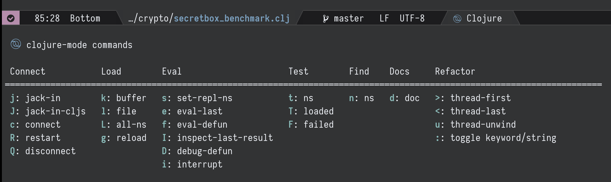

## Description

Inspired by [Spacemacs major mode leader
key](http://spacemacs.org/doc/DOCUMENTATION.html#major-mode-leader-key)
and based on the awesome [hydra](https://github.com/abo-abo/hydra),
this package offers a better way to manage your major mode specific
key bindings.

## Install

This package depends on
[hydra](https://github.com/abo-abo/hydra). Make sure it's installed
first.

### MELPA

Coming soon

### Manual

Download the source code and put it wherever you like and add the
directory to the load path:

```elisp
(add-to-list 'load-path "/place/where/you/put/it/")
```

then `require` the package and bind the `major-mode-hydra` command to a key:

```elisp
(require 'major-mode-hydra)
(global-set-key (kbd "C-M-m") 'major-mode-hydra)
```

or if you prefer `use-package`:

```elisp
(use-package major-mode-hydra
  :bind
  ("C-M-m" . major-mode-hydra))
```

## Usage

Whenever the command `major-mode-hydra` is executed, a (nice-looking)
hydra for the major mode of the current buffer pops up.



Use the `major-mode-hydra-bind` macro to add heads to a major mode
hydra. The following is an example for `clojure-mode` (as shown in the
above screenshot):

```elisp
(major-mode-hydra-bind clojure-mode "Connect"
  ("j" cider-jack-in "jack-in")
  ("J" cider-jack-in-clojurescript "jack-in-cljs")
  ("c" cider-connect "connect")
  ("R" cider-restart "restart")
  ("Q" cider-quit "quit"))
(major-mode-hydra-bind clojure-mode "Load"
  ("k" cider-load-buffer "buffer")
  ("l" cider-load-file "file")
  ("L" cider-load-all-project-ns "all-ns")
  ("r" cider-refresh "reload"))
```

It takes the name of a major mode (it should be an unquoted symbol), a
column name and a list of hydra heads under that column. Each head is
defined exactly in the same way as `defhydra`. You can call
`major-mode-hydra-bind` multiple times for the same major mode in
different places. Every time it's called, the hydra for that major
mode will be recreated the next time `major-mode-hydra` command is
used.

The generated hydra has the following default options:

```elisp
(:exit t :hint nil :foreign-keys warn)
```

which means by default it quits the hydra after a head command is
executed. For major mode commands, this should usually be what you
want. You can override it for each head using head options:

```elisp
(major-mode-hydra-bind clojure-mode "Load"
  ("k" cider-load-buffer "buffer" :exit nil)
  ("l" cider-load-file "file" :color red))
```

### Pretty Hydra

This package includes `pretty-hydra.el` which is used by
`major-mode-hydra.el` but can also be used on its own. The following
is an example in my own configuration:

```elisp
(pretty-hydra-define jp-window (:hint nil :foreign-keys warn)
  (;; general window management commands
   "Windows" (("x" ace-delete-window "delete")
              ("m" ace-delete-other-windows "maximize")
              ("s" ace-swap-window "swap")
              ("a" ace-select-window "select")
              ("o" other-window "cycle")
              ("q" nil "quit"))
   ;; resize
   "Resize" (("h" move-border-left "←")
             ("j" move-border-down "↓")
             ("k" move-border-up "↑")
             ("l" move-border-right "→")
             ("n" balance-windows "balance"))
   ;; split
   "Split"  (("b" split-window-right "horizontally")
             ("B" split-window-horizontally-instead "horizontally instead")
             ("v" split-window-below "vertically")
             ("V" split-window-vertically-instead "vertically instead"))
   ;; zoom
   "Zoom" (("+" zoom-in "in")
           ("=" zoom-in)
           ("-" zoom-out "out")
           ("0" jp-zoom-default "reset"))))
```

Note that `hydra` itself seems to provide a similar feature using the
`:column` option but it doesn't seem to be documented in README. The
generated docstring also looks a bit different.

## License

Copyright © 2018 Jerry Peng

Distributed under the GNU General Public License, version 3
